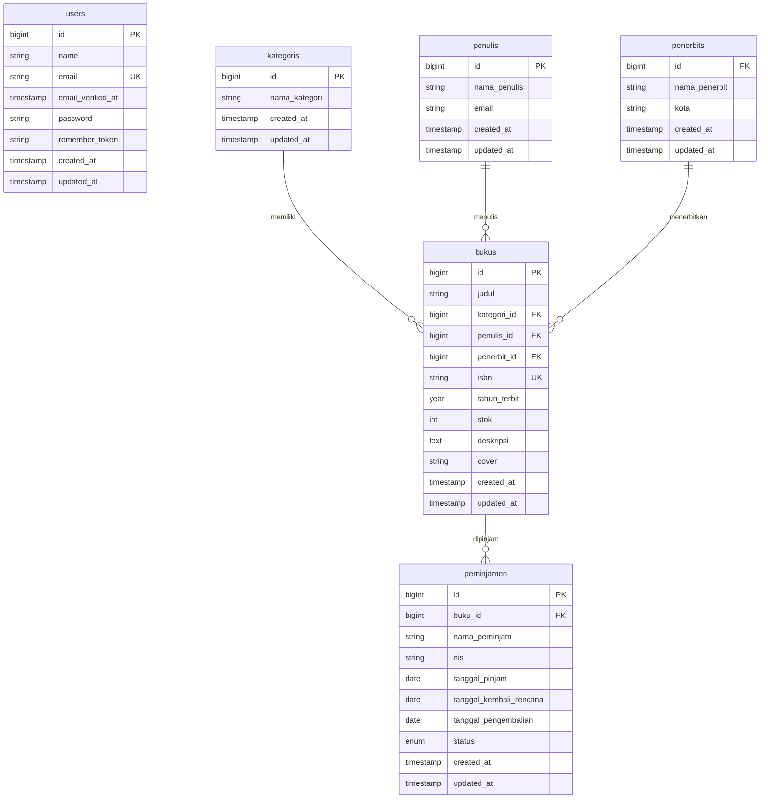

# Skema Database - Sistem Peminjaman Buku Perpustakaan

Dokumen ini berisi penjelasan detail mengenai skema database (*database schema*) yang digunakan dalam proyek ini, termasuk struktur tabel, tipe data, kunci (*keys*), serta hubungan (*relationships*) antar-entitas.

---

## 1. Diagram Hubungan Entitas (Entity Relationship Diagram - ERD)

Berikut adalah diagram hubungan antar entitas (ERD) dalam proyek ini menggunakan sintaks Mermaid:

---

## 2. Detail Spesifikasi Tabel

### A. Tabel `users`
Tabel ini digunakan untuk menyimpan data pengguna sistem/admin yang mengelola perpustakaan.

| Nama Kolom | Tipe Data | Atribut | Deskripsi |
| :--- | :--- | :--- | :--- |
| `id` | `bigint` | Primary Key, Auto Increment | ID unik pengguna |
| `name` | `varchar(255)` | Not Null | Nama lengkap pengguna |
| `email` | `varchar(255)` | Not Null, Unique | Email pengguna untuk login |
| `email_verified_at`| `timestamp` | Nullable | Waktu verifikasi email |
| `password` | `varchar(255)` | Not Null | Password terenkripsi |
| `remember_token` | `varchar(100)` | Nullable | Token untuk fitur *Remember Me* |
| `created_at` | `timestamp` | Nullable | Waktu data dibuat |
| `updated_at` | `timestamp` | Nullable | Waktu data terakhir diperbarui |

---

### B. Tabel `kategoris`
Tabel master untuk menyimpan kategori buku (contoh: Fiksi, Sains, Sejarah).

| Nama Kolom | Tipe Data | Atribut | Deskripsi |
| :--- | :--- | :--- | :--- |
| `id` | `bigint` | Primary Key, Auto Increment | ID unik kategori |
| `nama_kategori` | `varchar(100)` | Not Null | Nama kategori buku |
| `created_at` | `timestamp` | Nullable | Waktu data dibuat |
| `updated_at` | `timestamp` | Nullable | Waktu data terakhir diperbarui |

---

### C. Tabel `penulis`
Tabel master untuk menyimpan informasi penulis buku.

| Nama Kolom | Tipe Data | Atribut | Deskripsi |
| :--- | :--- | :--- | :--- |
| `id` | `bigint` | Primary Key, Auto Increment | ID unik penulis |
| `nama_penulis` | `varchar(150)` | Not Null | Nama penulis buku |
| `email` | `varchar(255)` | Nullable | Email penulis |
| `created_at` | `timestamp` | Nullable | Waktu data dibuat |
| `updated_at` | `timestamp` | Nullable | Waktu data terakhir diperbarui |

---

### D. Tabel `penerbits`
Tabel master untuk menyimpan informasi penerbit buku.

| Nama Kolom | Tipe Data | Atribut | Deskripsi |
| :--- | :--- | :--- | :--- |
| `id` | `bigint` | Primary Key, Auto Increment | ID unik penerbit |
| `nama_penerbit` | `varchar(150)` | Not Null | Nama perusahaan penerbit |
| `kota` | `varchar(255)` | Nullable | Kota asal penerbit |
| `created_at` | `timestamp` | Nullable | Waktu data dibuat |
| `updated_at` | `timestamp` | Nullable | Waktu data terakhir diperbarui |

---

### E. Tabel `bukus`
Tabel utama untuk menyimpan detail buku yang tersedia di perpustakaan.

| Nama Kolom | Tipe Data | Atribut | Deskripsi |
| :--- | :--- | :--- | :--- |
| `id` | `bigint` | Primary Key, Auto Increment | ID unik buku |
| `judul` | `varchar(200)` | Not Null | Judul buku |
| `kategori_id` | `bigint` | Foreign Key (`kategoris.id`), Cascade | Hubungan ke kategori buku |
| `penulis_id` | `bigint` | Foreign Key (`penulis.id`), Cascade | Hubungan ke penulis buku |
| `penerbit_id` | `bigint` | Foreign Key (`penerbits.id`), Cascade | Hubungan ke penerbit buku |
| `isbn` | `varchar(20)` | Not Null, Unique | Kode ISBN buku |
| `tahun_terbit` | `year` | Not Null | Tahun terbit buku |
| `stok` | `int` | Not Null, Default: `0` | Jumlah stok buku fisik yang tersedia |
| `deskripsi` | `text` | Nullable | Sinopsis atau deskripsi buku |
| `cover` | `varchar(255)` | Nullable | Path/nama file cover buku |
| `created_at` | `timestamp` | Nullable | Waktu data dibuat |
| `updated_at` | `timestamp` | Nullable | Waktu data terakhir diperbarui |

---

### F. Tabel `peminjamen`
Tabel transaksi untuk mencatat aktivitas peminjaman buku oleh siswa.

| Nama Kolom | Tipe Data | Atribut | Deskripsi |
| :--- | :--- | :--- | :--- |
| `id` | `bigint` | Primary Key, Auto Increment | ID unik transaksi peminjaman |
| `buku_id` | `bigint` | Foreign Key (`bukus.id`), Cascade | Buku yang dipinjam |
| `nama_peminjam` | `varchar(150)` | Not Null | Nama siswa yang meminjam |
| `nis` | `varchar(30)` | Not Null | Nomor Induk Siswa peminjam |
| `tanggal_pinjam` | `date` | Not Null | Tanggal mulai pinjam |
| `tanggal_kembali_rencana` | `date` | Not Null | Tenggat waktu pengembalian buku |
| `tanggal_pengembalian` | `date` | Nullable | Tanggal buku dikembalikan |
| `status` | `enum('dipinjam', 'dikembalikan', 'terlambat')` | Not Null, Default: `'dipinjam'` | Status peminjaman |
| `created_at` | `timestamp` | Nullable | Waktu transaksi dibuat |
| `updated_at` | `timestamp` | Nullable | Waktu transaksi terakhir diupdate |

---

## 3. Hubungan Relasi (*Relationships*) & Aturan Integritas Data

1. **Relasi Buku & Master Data**:
   - Satu Buku hanya memiliki satu Kategori (`belongsTo`), satu Penulis (`belongsTo`), dan satu Penerbit (`belongsTo`).
   - Kategori, Penulis, dan Penerbit dapat dikaitkan ke banyak Buku (`hasMany`).
   - **Aturan Delete**: Jika kategori, penulis, atau penerbit dihapus, maka buku-buku terkait juga akan ikut terhapus secara otomatis (`onDelete('cascade')`).

2. **Relasi Peminjaman & Buku**:
   - Satu transaksi peminjaman mencatat peminjaman satu Buku (`belongsTo`).
   - Satu Buku dapat dipinjam berkali-kali dalam transaksi yang berbeda (`hasMany`).
   - **Aturan Delete**: Jika data buku dihapus, seluruh riwayat transaksi peminjaman buku tersebut juga akan ikut terhapus (`onDelete('cascade')`).
